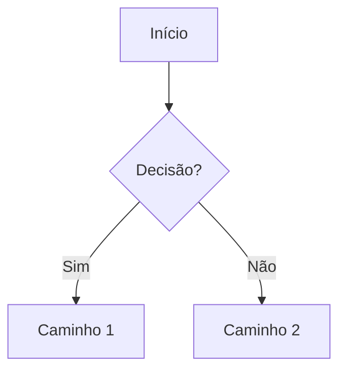

# Obsidian Patterns — padrão da smart-memory

Toda escrita em `docs/smart-memory/` segue este padrão. É a referência canônica usada pelos
agentes (architect, researcher, data, ux, qa) ao gravar conhecimento. Espelha o schema completo
em `team-os-creator/reference/smart-memory-integration.md`.

## 1. Frontmatter obrigatório

Todo `.md` em `docs/smart-memory/` começa com YAML:

```yaml
---
title: "..."
type: overview | story | decision | research | qa-result | schema | task-log | backlog | status-board | index | component-spec
status: active | backlog | done | deprecated | proposed | accepted   # quando aplicável
agent: <nome-do-agente>
created: YYYY-MM-DD
updated: YYYY-MM-DD
tags: [...]
related: ["[[...]]", "[[...]]"]
---
```

## 2. Wikilinks

- Navegação SEMPRE por wikilink `[[arquivo]]` — nunca link relativo cru no corpo.
- Atualizar `docs/smart-memory/INDEX.md` (MOC raiz) ao criar arquivo novo.

## 3. Tags canônicas (não inventar)

`#project` · `#architecture` · `#story` · `#decision` · `#research` · `#qa` · `#database` · `#ux` · `#security` · `#performance` · `#task-log`

## 4. Datas

ISO 8601 (`YYYY-MM-DD`) — nunca relativas ("ontem", "semana passada").

## 5. Diagramas

Mermaid no corpo, em bloco ```mermaid```. Usado em ADRs (arquitetura) e user flows (UX).



## 6. Frontmatter por tipo (exemplos)

### ADR (`type: decision`)
```yaml
---
title: "ADR-{N}: {Título}"
type: decision
status: proposed | accepted | deprecated
agent: {architect}
created: YYYY-MM-DD
updated: YYYY-MM-DD
tags: [architecture, {domínio}]
related: ["[[../agents/research/{tema}]]"]
---
```

### Research report (`type: research`)
```yaml
---
title: "Research: {tema}"
type: research
agent: {researcher}
created: YYYY-MM-DD
updated: YYYY-MM-DD
tags: [research, {domínio}]
related: ["[[../../decisions/ADR-{N}]]"]
---
```

### Story → ver `team-os/templates/story.md`.

## 7. Anti-patterns

- Não misturar responsabilidades de escrita (ex.: architect não escreve `tech-stack.md` — é do analyst/researcher).
- Não deixar arquivo órfão: sempre referenciar no `INDEX.md`.
- Não escrever conhecimento canônico fora de `docs/smart-memory/`.
