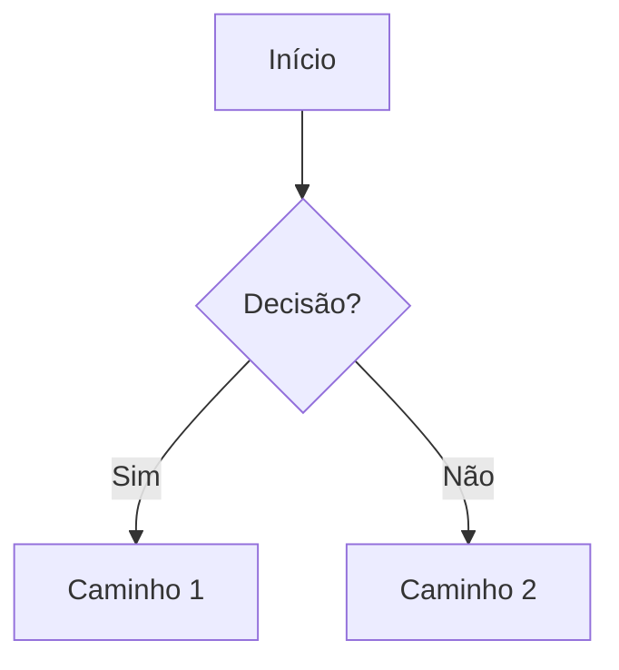

# Obsidian Patterns — padrão da smart-memory (v3)

Toda escrita em `docs/smart-memory/` segue este padrão. É a referência canônica usada pelos
agentes (architect, researcher, data, ux, qa) ao gravar conhecimento. Espelha o schema completo
em `team-os-creator/reference/smart-memory-integration.md`.

## 0. Princípio: estado, não histórico — em fatos atômicos

A smart-memory guarda **o estado atual e as decisões** — não a narrativa de como se chegou lá.
Antes de escrever, pergunte: *"isso muda decisões futuras?"* Se não, não entra (ou vai direto
ao `_archive/`). Evidência bruta (dumps de query, logs, transcrições) **nunca** entra no
working set — fica no PR/código ou vai ao `_archive/`.

A unidade de memória é o **fato atômico datado**: uma linha, uma afirmação, uma data.

```
- [2026-09-05] Checkout usa Stripe Payment Intents; webhooks em /api/stripe/webhook.
```

Um fato novo sobre o mesmo assunto **substitui** o antigo (mesma linha, data nova) — nunca
acumula. Se a substituição acontece em nível de nota, use `supersedes:` (ver §1).

## 1. Frontmatter obrigatório

Todo `.md` em `docs/smart-memory/` começa com YAML **na linha 1** (os scripts ancoram o parser
na linha 1 ser `---` — um `---` no meio do corpo não abre frontmatter):

```yaml
---
title: "..."
kind: reference | episode | digest    # ← ciclo de vida (ver §1.1)
type: overview | story | decision | research | qa-result | schema | task-log | backlog | status-board | index | component-spec
status: active | resolved | superseded | backlog | done | deprecated | proposed | accepted
expires: YYYY-MM-DD                   # TTL — opcional; vencido = arquivado automaticamente no *compact
supersedes: "[[nota-anterior]]"       # quando esta nota substitui outra (a antiga vira status: superseded)
summary: >                            # 1-2 linhas — o que o sm-find e o DIGEST enxergam
  Conclusão essencial da nota em linguagem direta.
agent: <nome-do-agente>
created: YYYY-MM-DD
updated: YYYY-MM-DD
tags: [...]
related: ["[[...]]", "[[...]]"]
---
```

### 1.1 `kind` — os três tipos de nota

| `kind` | O que é | Ciclo de vida |
|---|---|---|
| `reference` | Conhecimento vivo (estático): schema-map, metric-dictionary, conventions, specs vigentes | **Atualizada in-place**, nunca arquivada. `status: active` sempre. Sem `expires`. |
| `episode` | Trabalho pontual (dinâmico): audit, investigation, fix, plano, QA de uma rodada | Nasce `active` → vira `resolved` (concluído) ou `superseded` (substituído). Pode nascer com `expires:` (TTL). **Resolved/superseded/expirado = arquivado automaticamente** no próximo `*compact`. |
| `digest` | Resumo vivo de uma área (`DIGEST.md`) | Atualizada in-place. Nunca arquivada. Formato v3: Core / Contexto recente / Apontadores (ver template). |

### 1.2 TTL (`expires:`) e superseding (`supersedes:`)

- **`expires: YYYY-MM-DD`** — para notas cujo valor tem prazo natural (status de sprint,
  contexto de campanha, workaround temporário). No `*compact`, toda nota com `expires` vencido
  vai automaticamente para `_archive/<Q>/expired/` e é registrada no LEDGER como "(expired)".
  O `weigh-memory.sh` lista as vencidas como "arquiváveis" (informativo, não força HEAVY).
- **`supersedes: "[[nota-antiga]]"`** — o fato/nota nova aponta o que substitui; ao criá-la,
  marque a antiga com `status: superseded` (candidata automática ao `_archive/`).

### 1.3 Regras de escrita enxuta (anti-inchaço)

1. **Update-in-place, não append.** Round 2 de uma investigação **atualiza a nota existente**
   (e registra 1 linha num mini-changelog no corpo) — não cria `investigation-round2.md`.
   Proibido sufixo de versão em nome de arquivo (`-r3`, `-v2`, `-final`).
2. **Teto de ~300 linhas por episódio.** Conclusões e decisões na nota; o que passar disso
   é apêndice → direto no `_archive/` com wikilink.
3. **Ao concluir um episódio**: marque `status: resolved` no frontmatter e atualize o
   `DIGEST.md` da área (fato atômico em Core ou Contexto recente + apontador se necessário).
   Se ele substitui nota anterior, marque a antiga `status: superseded` e aponte `supersedes` na nova.
4. **`summary` é obrigatório em episódios** — é o que o `sm-find.sh` mostra e o que sobrevive
   quando o corpo for arquivado.
5. **DIGEST ≤ ~40 linhas, bullets ≤ 200 chars, nada de prosa** (regras no rodapé do template).

## 2. `_inbox/` — anotar barato, consolidar em lote

Durante a sessão, um agente que descobre algo digno de memória mas não quer parar para
atualizar DIGESTs escreve uma nota curta em `docs/smart-memory/_inbox/` (frontmatter mínimo:
`summary` + `agent` + data). É **escrita barata, sem obrigação de curadoria**.

A consolidação é **em lote, no `*compact`**: o archivist lê o `_inbox/` inteiro de uma vez,
funde/deduplica/supersede contra os DIGESTs das áreas e zera o inbox
(`compact-memory.sh --clear-inbox <arquivo>` move cada nota consolidada para
`_archive/<Q>/inbox/`). O `compact-memory.sh` reporta o pendente em `COMPACT_INBOX_PENDING=`.

Regra: o `_inbox/` **não é leitura de bootstrap** — ninguém precisa lê-lo para trabalhar.

## 3. Disciplina summary-first (leitura em camadas)

A leitura de memória tem 3 níveis — pare no mais raso que resolver:

- **L0 — DIGEST da área** (`agents/<área>/DIGEST.md`): única leitura obrigatória do bootstrap,
  além do INDEX e das stories ativas. Orçamento: `weigh-memory.sh` mede esse custo por área
  (`WEIGH_BOOTSTRAP_*`, budget default 2000 tokens).
- **L1 — `sm-find.sh <termos>`**: busca por metadados (kind/status/summary/tags/H1/filename).
  Retorna `path → kind → status → summary` — **nunca conteúdo**. Buscar antes de ler.
- **L2 — a nota inteira**: só quando um match do L1 justificar. **Máx 3 notas por tarefa.**

## 4. Wikilinks

- Navegação SEMPRE por wikilink `[[arquivo]]` — nunca link relativo cru no corpo.
- Atualizar `docs/smart-memory/INDEX.md` (MOC raiz) ao criar arquivo novo.
- Ao criar/resolver episódio, atualizar também o `DIGEST.md` da área.
- O `*compact` reporta wikilinks órfãos (`COMPACT_ORPHAN_LINKS=`) deixados por arquivamentos —
  corrija-os no mesmo fluxo (aponte para o LEDGER ou remova a referência).

## 5. Tags canônicas (não inventar)

`#project` · `#architecture` · `#story` · `#decision` · `#research` · `#qa` · `#database` · `#ux` · `#security` · `#performance` · `#task-log`

## 6. Datas

ISO 8601 (`YYYY-MM-DD`) — nunca relativas ("ontem", "semana passada"). Vale para frontmatter
(`created`/`updated`/`expires`) e para os fatos atômicos dos DIGESTs (`- [YYYY-MM-DD] ...`).

## 7. Diagramas

Mermaid no corpo, em bloco ```mermaid```. Usado em ADRs (arquitetura) e user flows (UX).


```mermaid
flowchart TD
  A[Início] --> B{Decisão?}
  B -->|Sim| C[Caminho 1]
  B -->|Não| D[Caminho 2]
```

## 8. Frontmatter por tipo (exemplos)

### ADR (`type: decision`)
```yaml
---
title: "ADR-{N}: {Título}"
type: decision
status: proposed | accepted | deprecated
agent: {architect}
created: YYYY-MM-DD
updated: YYYY-MM-DD
tags: [architecture, {domínio}]
related: ["[[../agents/research/{tema}]]"]
---
```

### Research report (`type: research`)
```yaml
---
title: "Research: {tema}"
type: research
kind: episode
status: active
expires: YYYY-MM-DD        # se a pesquisa tem validade natural
summary: >
  {conclusão em 1-2 linhas}
agent: {researcher}
created: YYYY-MM-DD
updated: YYYY-MM-DD
tags: [research, {domínio}]
related: ["[[../../decisions/ADR-{N}]]"]
---
```

### Story → ver `team-os/templates/story.md`.
### DIGEST de área → ver `team-os/templates/digest.md` (formato v3).

## 9. Anti-patterns

- Não misturar responsabilidades de escrita (ex.: architect não escreve `tech-stack.md` — é do analyst/researcher).
- Não deixar arquivo órfão: sempre referenciar no `INDEX.md` (e no `DIGEST.md` da área, se episódio).
- Não escrever conhecimento canônico fora de `docs/smart-memory/`.
- Não criar arquivo novo para nova rodada do mesmo tópico — atualizar a nota existente (§1.3).
- Não colar evidência bruta (dumps, logs, saídas longas) no working set — `_archive/` ou fora.
- Não ler `_archive/` nem pastas inteiras de outras áreas — a porta de entrada é o DIGEST (L0)
  e a busca é o `sm-find.sh` (L1); nota inteira só com match (L2, máx 3 por tarefa).
- Não escrever prosa em DIGEST — só fatos atômicos datados, bullets ≤200 chars, ≤~40 linhas.
- Não acumular histórico em DIGEST — fato novo substitui o antigo na mesma linha.
- Não usar o `_inbox/` como memória de leitura — é fila de consolidação, zerada a cada `*compact`.
- Não deixar episódio sem `summary` nem, quando fizer sentido, sem `expires` — sem metadados,
  o sm-find não encontra e o compact não esfria.
